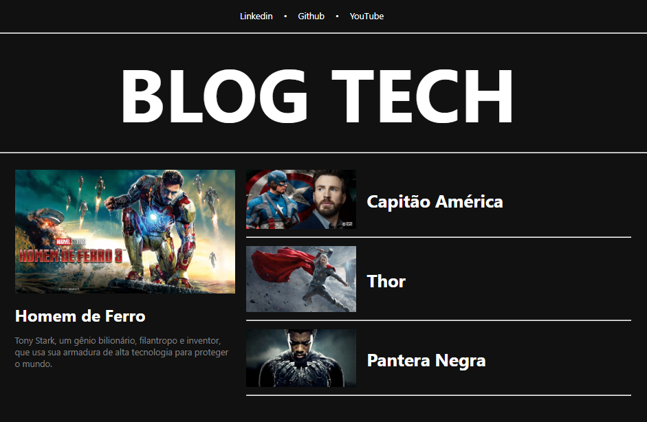

# 🌐 Angular - Blog Tech
<div align="center">
  
</div>

<p align="center">
  <a href="https://github.com/guedes-jr/angular-blog">
    
  </a>
  <a href="https://github.com/guedes-jr/angular-blog/issues">
    
  </a>
  <a href="https://github.com/guedes-jr/angular-blog/network">
    
  </a>
  <a href="https://github.com/guedes-jr/angular-blog/stargazers">
    
  </a>
  <a href="https://github.com/guedes-jr/angular-blog/blob/main/LICENSE">
    
  </a>
</p>

## 📝 Sumário

- [Sobre o Projeto](#%EF%B8%8Fsobre-o-projeto)
- [Tecnologias Utilizadas](#-tecnologias-utilizadas)
- [Funcionalidades](#-funcionalidades)
- [Requisitos](#-requisitos)
- [Instalação](#-instalação)
- [Diagrama de Fluxo de Processo](#-diagrama-de-fluxo-de-processo)
- [Scripts Disponíveis](#-scripts-disponíveis)
- [Estrutura de Pastas](#-estrutura-de-pastas)
- [Contribuindo](#-contribuindo)
- [Licença](#-licença)
- [Contato](#-contato)

## 🛠️Sobre o Projeto

Descrição do projeto que está sendo desenvoido

## 🧰 Tecnologias Utilizadas

- [Angular 14](https://v14.angular.io/docs) - Framework para front-end
- [Typescript](https://www.typescriptlang.org)
- [CSS](https://nextjs.org/) - Estilização
- [HTML](https://www.postgresql.org/) - Estrutura base das páginas

## ✨ Funcionalidades

 - Página incial, contendo um card principal e uma lista do demais 
 - Menu com redirecionamentos para redes sociais 
 - Página de apresentação do conteúdo de cada posto

## 📋 Requisitos

- [Node.js 19 ou superior](https://nodejs.org/pt/blog/release/v19.9.0)
- [Typescript](https://www.typescriptlang.org/download/)

> Para evitar erros com relação a versão do typescript use o arquivo de dependências de desenvolvimento a seguir
```json
"devDependencies": {
    "@angular-devkit/build-angular": "^14.2.13",
    "@angular/cli": "~14.2.13",
    "@angular/compiler-cli": "^14.2.0",
    "@types/jasmine": "~4.0.0",
    "jasmine-core": "~4.3.0",
    "karma": "~6.4.0",
    "karma-chrome-launcher": "~3.1.0",
    "karma-coverage": "~2.2.0",
    "karma-jasmine": "~5.1.0",
    "karma-jasmine-html-reporter": "~2.0.0",
    "typescript": "~4.8.4"
  }
```

## 🚀 Instalação

### Clonando o Repositório

```bash
git clone https://github.com/guedes-jr/angular-blog.git
```

### Executar em Ambiente de Desenvolvimento

1. **Acesse o diretório do projeto**  
   Navegue até o diretório do projeto:
   ```bash
   cd angular-blog
   ```

2. **Instale as dependências**  
   Use o comando abaixo para instalar os módulos do **Node.js** necessários:
   ```bash
   npm install
   ```

3. **Inicie o servidor de desenvolvimento**  
   Execute o comando para iniciar o servidor:
   ```bash
   ng serve
   ```

4. **Acesse a aplicação**  
   Abra o navegador e acesse o endereço padrão:
   ```
   http://localhost:4200
   ```

### Deploy

Siga os passos abaixo para realizar o deploy da aplicação:

1. **Build da aplicação**  
   Gere os arquivos otimizados para produção:
   ```bash
   npm run build
   ```

2. **Configuração do servidor**  
   Certifique-se de que o servidor está configurado para servir os arquivos estáticos gerados na pasta `dist/`.

3. **Deploy no servidor**  
   Copie os arquivos da pasta `dist/` para o servidor de produção. Você pode usar ferramentas como `scp` ou serviços de hospedagem como AWS, Vercel ou Netlify.

4. **Configuração do domínio (opcional)**  
   Configure o domínio no provedor de hospedagem para apontar para o servidor onde a aplicação está hospedada.

Agora sua aplicação estará disponível em produção!

> **Nota:** Certifique-se de que você possui o [Node.js](https://nodejs.org/) e o [Angular CLI](https://angular.io/cli) instalados no seu sistema. Caso não tenha o Angular CLI, instale-o globalmente com:
```bash
npm install -g @angular/cli@14
```

## 📦 Scripts Disponíveis

Na raiz do projeto, você pode rodar:

- `npm start`: Inicia o servidor de desenvolvimento Angular.
- `npm run build`: Compila a aplicação para produção e gera os arquivos na pasta `dist/`.
- `npm test`: Executa os testes unitários configurados com Karma.
- `npm run lint`: Verifica o código com as regras de lint configuradas.

### Comandos úteis do Angular CLI

Além dos scripts acima, você pode usar os seguintes comandos do Angular CLI para gerenciar o projeto:

- `ng generate component <nome>`: Gera um novo componente Angular.
- `ng generate service <nome>`: Gera um novo serviço Angular.
- `ng generate module <nome>`: Gera um novo módulo Angular.
- `ng build`: Compila a aplicação para produção.
- `ng serve`: Inicia o servidor de desenvolvimento.
- `ng test`: Executa os testes unitários.
- `ng lint`: Verifica o código com as regras de lint configuradas.
- `ng add <pacote>`: Adiciona pacotes e configurações ao projeto (ex.: `ng add @angular/material`).
- `ng update`: Atualiza as dependências do Angular para a versão mais recente.
- `ng e2e`: Executa testes de ponta a ponta (caso configurado).

## 🧭 Diagrama de Fluxo de Processo

```mermaid
flowchart TB
    title["AngularBlog Front-End Architecture"]

    subgraph "Build & Config"
        angularJSON["angular.json"]:::build
        packageJSON["package.json"]:::build
        tsconfigApp["tsconfig.app.json"]:::build
        tsconfigSpec["tsconfig.spec.json"]:::test
        tsconfig["tsconfig.json"]:::build
        karmaConf["karma.conf.js"]:::test
    end

    subgraph "Browser & Bootstrap"
        indexHTML["index.html"]:::asset
        polyfillsTS["polyfills.ts"]:::asset
        mainTS["main.ts"]:::module
    end

    subgraph "Angular Core"
        appModule["AppModule"]:::module
        appRouting["AppRoutingModule"]:::module
        routerOutlet["RouterOutlet"]:::module
    end

    subgraph "Page Components"
        homeComp["HomeComponent"]:::page
        contentComp["ContentComponent"]:::page
    end

    subgraph "Shared UI Components"
        bigCard["BigCardComponent"]:::component
        smallCard["SmallCardComponent"]:::component
        menuBar["MenuBarComponent"]:::component
        menuTitle["MenuTitleComponent"]:::component
    end

    subgraph "Data Layer"
        dataFake["DataFakeService"]:::service
    end

    subgraph "Environment Configs"
        envDev["environment.ts"]:::environment
        envProd["environment.prod.ts"]:::environment
    end

    subgraph "Assets & Styles"
        stylesCSS["styles.css"]:::asset
        assets["assets/"]:::asset
    end

    subgraph "Testing Harness"
        testSetup["test.ts"]:::test
        unitTest["app.component.spec.ts"]:::test
    end

    %% Flow
    angularJSON & packageJSON & tsconfig & tsconfigApp & tsconfigSpec & karmaConf -->|build config| mainTS
    indexHTML -->|loads| polyfillsTS -->|initializes| mainTS
    mainTS -->|bootstraps| appModule
    appModule --> appRouting
    appRouting --> routerOutlet
    routerOutlet -->|route /| homeComp
    routerOutlet -->|route /content| contentComp

    homeComp & contentComp -->|injects| dataFake
    dataFake -->|provides data| bigCard & smallCard & menuBar & menuTitle

    appModule --> bigCard & smallCard & menuBar & menuTitle

    envDev & envProd -->|config| appModule

    assets & stylesCSS -->|included| appModule

    testSetup --> unitTest
    unitTest --> appModule

    %% Click events
    click indexHTML "https://github.com/guedes-jr/angular-blog/blob/main/src/index.html"
    click polyfillsTS "https://github.com/guedes-jr/angular-blog/blob/main/src/polyfills.ts"
    click mainTS "https://github.com/guedes-jr/angular-blog/blob/main/src/main.ts"
    click angularJSON "https://github.com/guedes-jr/angular-blog/blob/main/angular.json"
    click packageJSON "https://github.com/guedes-jr/angular-blog/blob/main/package.json"
    click tsconfig "https://github.com/guedes-jr/angular-blog/blob/main/tsconfig.json"
    click tsconfigApp "https://github.com/guedes-jr/angular-blog/blob/main/tsconfig.app.json"
    click tsconfigSpec "https://github.com/guedes-jr/angular-blog/blob/main/tsconfig.spec.json"
    click karmaConf "https://github.com/guedes-jr/angular-blog/blob/main/karma.conf.js"
    click appModule "https://github.com/guedes-jr/angular-blog/blob/main/src/app/app.module.ts"
    click appRouting "https://github.com/guedes-jr/angular-blog/blob/main/src/app/app-routing.module.ts"
    click homeComp "https://github.com/guedes-jr/angular-blog/blob/main/src/app/pages/home/home.component.ts"
    click contentComp "https://github.com/guedes-jr/angular-blog/blob/main/src/app/pages/content/content.component.ts"
    click bigCard "https://github.com/guedes-jr/angular-blog/blob/main/src/app/components/big-card/big-card.component.ts"
    click smallCard "https://github.com/guedes-jr/angular-blog/blob/main/src/app/components/small-card/small-card.component.ts"
    click menuBar "https://github.com/guedes-jr/angular-blog/blob/main/src/app/components/menu-bar/menu-bar.component.ts"
    click menuTitle "https://github.com/guedes-jr/angular-blog/blob/main/src/app/components/menu-title/menu-title.component.ts"
    click dataFake "https://github.com/guedes-jr/angular-blog/blob/main/src/app/data/dataFake.ts"
    click envDev "https://github.com/guedes-jr/angular-blog/blob/main/src/environments/environment.ts"
    click envProd "https://github.com/guedes-jr/angular-blog/blob/main/src/environments/environment.prod.ts"
    click stylesCSS "https://github.com/guedes-jr/angular-blog/blob/main/src/styles.css"
    click assets "https://github.com/guedes-jr/angular-blog/blob/main/src/assets/.gitkeep"
    click unitTest "https://github.com/guedes-jr/angular-blog/blob/main/src/app/app.component.spec.ts"
    click testSetup "https://github.com/guedes-jr/angular-blog/blob/main/src/test.ts"

    %% Styles
    classDef build fill:#fde2e2,stroke:#f00,stroke-width:1px
    classDef module fill:#e0e7ff,stroke:#4361ee,stroke-width:1px
    classDef component fill:#f0f0f0,stroke:#9e9e9e,stroke-width:1px
    classDef page fill:#e2f0cb,stroke:#558b2f,stroke-width:1px
    classDef service fill:#cff4fc,stroke:#0288d1,stroke-width:1px,shape:cylinder
    classDef environment fill:#fff3e0,stroke:#fb8c00,stroke-width:1px,shape:diamond
    classDef asset fill:#f3e5f5,stroke:#6a1b9a,stroke-width:1px
    classDef test fill:#e8f5e9,stroke:#2e7d32,stroke-width:1px
```


## 📁 Estrutura de Pastas

```plaintext
├── README.md
├── angular.json
├── karma.conf.js
├── package-lock.json
├── package.json
├── src
│   ├── app
│   │   ├── app-routing.module.ts
│   │   ├── app.component.css
│   │   ├── app.component.html
│   │   ├── app.component.spec.ts
│   │   ├── app.component.ts
│   │   ├── app.module.ts
│   │   ├── components
│   │   │   ├── big-card
│   │   │   │   ├── big-card.component.css
│   │   │   │   ├── big-card.component.html
│   │   │   │   └── big-card.component.ts
│   │   │   ├── menu-bar
│   │   │   │   ├── menu-bar.component.css
│   │   │   │   ├── menu-bar.component.html
│   │   │   │   └── menu-bar.component.ts
│   │   │   ├── menu-title
│   │   │   │   ├── menu-title.component.css
│   │   │   │   ├── menu-title.component.html
│   │   │   │   ├── menu-title.component.ts
│   │   │   │   └── menu-title.responsive.component.css
│   │   │   └── small-card
│   │   │       ├── small-card.component.css
│   │   │       ├── small-card.component.html
│   │   │       └── small-card.component.ts
│   │   ├── data
│   │   │   └── dataFake.ts
│   │   └── pages
│   │       ├── content
│   │       │   ├── content.component.css
│   │       │   ├── content.component.html
│   │       │   └── content.component.ts
│   │       └── home
│   │           ├── home.component.css
│   │           ├── home.component.html
│   │           └── home.component.ts
│   ├── assets
│   │   └── img
│   │       └── banner.png
│   ├── environments
│   │   ├── environment.prod.ts
│   │   └── environment.ts
│   ├── favicon.ico
│   ├── index.html
│   ├── main.ts
│   ├── polyfills.ts
│   ├── styles.css
│   └── test.ts
├── tsconfig.app.json
├── tsconfig.json
└── tsconfig.spec.jso
```

## 🤝 Contribuindo

Contribuições são bem-vindas! Sinta-se à vontade para abrir uma issue ou enviar um pull request.

1. Faça um fork do projeto
2. Crie uma nova branch (`git checkout -b feature/nova-funcionalidade`)
3. Commit suas alterações (`git commit -m 'Adiciona nova funcionalidade'`)
4. Faça o push para a branch (`git push origin feature/nova-funcionalidade`)
5. Abra um Pull Request

## 📄 Licença

Este projeto está licenciado sob a Licença MIT - veja o arquivo [LICENSE](LICENSE) para detalhes.

## 📧 Contato

👤 **Seu Nome**

- Github: [@guedes-jr](https://github.com/guedes-jr)
- LinkedIn: [João Guedes](https://www.linkedin.com/in/jo%C3%A3o-guedes-36a440135)
- Email: joao.guedes.developer@gmail.com

---

Desenvolvido com profissionalismo por [João Guedes](https://github.com/guedes-jr) 🤖.
